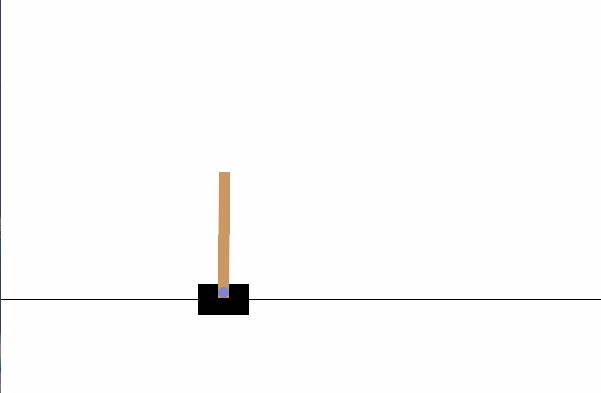

# Gymnasium-Cart-Pole

## About Gymnasium
Gymnasium is an open-source Python library maintained by the Farama Foundation. It offers a rich collection of pre-built environments for reinforcement learning agents, a standard API for communication between learning algorithms and environments, and a standard set of environments compliant with that API. 

## Installation

Install cart-pole with pip. To install the base Gymnasium library, use:

```bash
py -m !pip install gymnasium
```
other dependencies:
1) pip: Usually, pip is automatically installed. To install pip:
```bash
C:> py -m ensurepip --upgrade
```
2) TensorFlow:
```bash
python3 -m pip install tensorflow[and-cuda]
# Verify the installation:
python3 -c "import tensorflow as tf; print(tf.config.list_physical_devices('GPU'))"
```
3) matplotlib:
```bash
python -m pip install -U pip
python -m pip install -U matplotlib
```  


